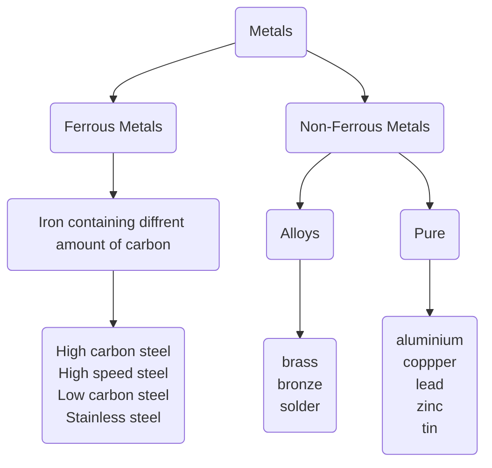

# Metals!

### Ferrous Metals & Non Ferrous Metals
Any metal that contains Ferrite will rust when it comes into contact with water. A test you can do is to see if it was magnetic which means it is magnetic.
Any metal that does not contain Ferrite it will not rust and will not be magnetic.

The way you can obtain Ferrous is by digging up iron ore from the ground, It is then brought to a refactory, then it is put into a series of furnaces to make metals. All iron ore will then have to go through The Blast Furnace.

### Upgrading the quality of the metal
The quality of the metal when it comes out of The Blast Furnace and cant be used for many important tasks, so we need to put it through a furnace which uses a cleaner fuel so it can be more refined, this furnace is called The Oxygen Furnace. Once the metal has been put through the The Oxygen Furnace and The Blast Furnace it can be shipped out and put in stores or it can be refined more and put through The electric arc furnace.

#### Links
#Engineering #Metals #Manufacturing

