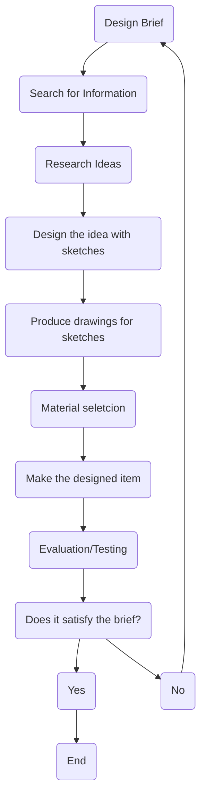

### Why do we design new inventions

- Inventions are created when there is a specific need for something new.

- Designing involves thinking, creating, problem solving, decision making, working on ones own initiative and applying previously developed knowledge. A student should look at and study all mechanisms and inventions to recognise good design skills.

- There are different methods for going through the process of design. There is many steps that must be compelted before you can finally finish your project. They are detailed below.

#### Links
#Engineering #Design