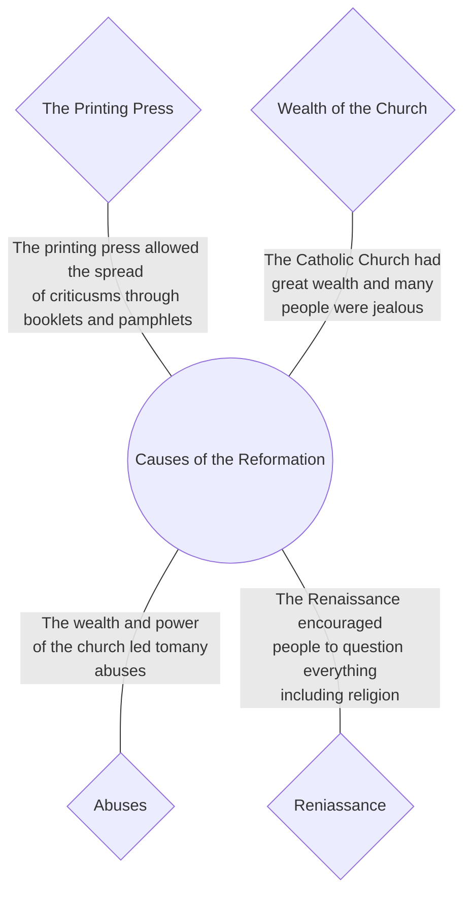

- In 1500 most people in Western Europe were Roman Catholics. People believed that the Church provided all the answers to life and that only the Catholic Church could offer salvation (a place in Heaven).

- Most people in Europe most people were Roman catholic, but this then split up into many branches of Christianity. The Catholic Church was extremely powerful and owned over a 1/3 of the land in Europe. Martin Luther was the main causes of the reformation. 

![[Religion.png]]

- The Pope in Rome was the leader. Less than 100 years later, most people in Northern Europe were Protestant. The Reformation began in Germany in the 16th century, originally as an attempt to improve the Catholic Church.

### Catholic Church Abuses

1. Nepotism - `Giving important positions in the Church to relatives wether they were sutiable or not`
2. Simony - `Paying bribes to become a biship or abbot`
3. Pluralism - `Holding several church positions at the same time`
4. Absenteeism - `Living away from the place they were appointed to serve`
5. Indulgences - `People paying money to the church to but salvation from their sins`

- By 1500 the Church had collected an enormous amount of wealth. In Germany, the Catholic Church owned about one-third of the land. People became jealous of this wealth. Many princes and kings wanted to use this wealth to build up their countries.

- The Renaissance encouraged people to question everything. This applied to all areas of knowledge, including religion. Many people began to criticize the Church and say that it was not following the teaching of the Bible. 

> [!Study]
> If you are struggling to remember the abuses here is a simple trick to help you remember!
> **S**imony
> **N**epotism
> **A**bsenteeism
> **P**luralism
> **S**ale of Indulgences

### Power of Kings and Princes
![[Reformation king.png]]

- Kings were uniting their countries under their control. They had dealt with independent lords, and now they wanted to control the power and influence of the Catholic Church.

#### Links
#History #Reformation #BeginningOfTheReformation