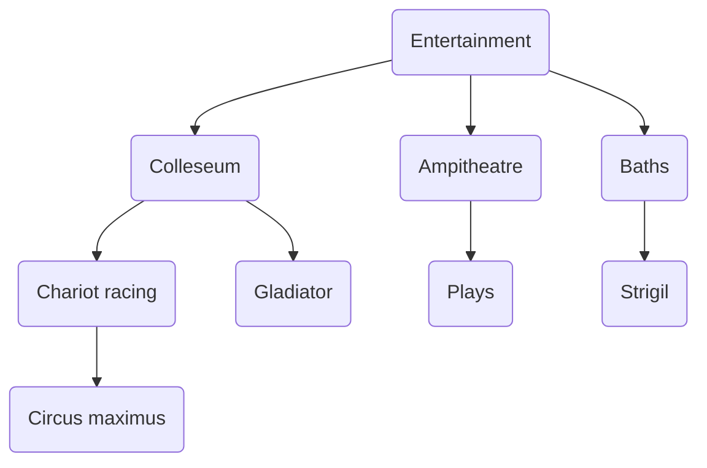
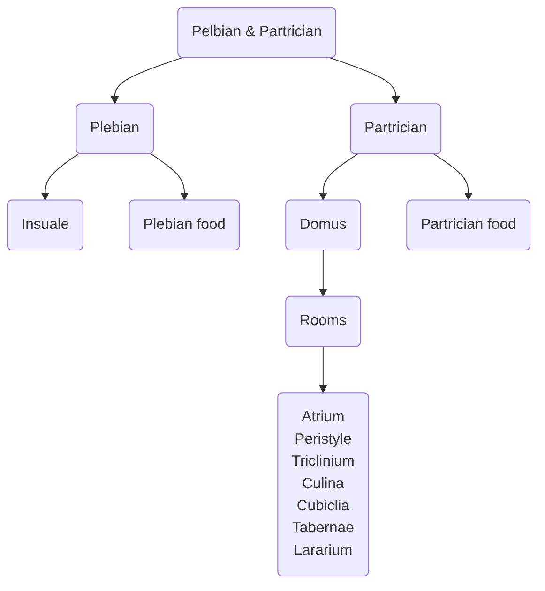
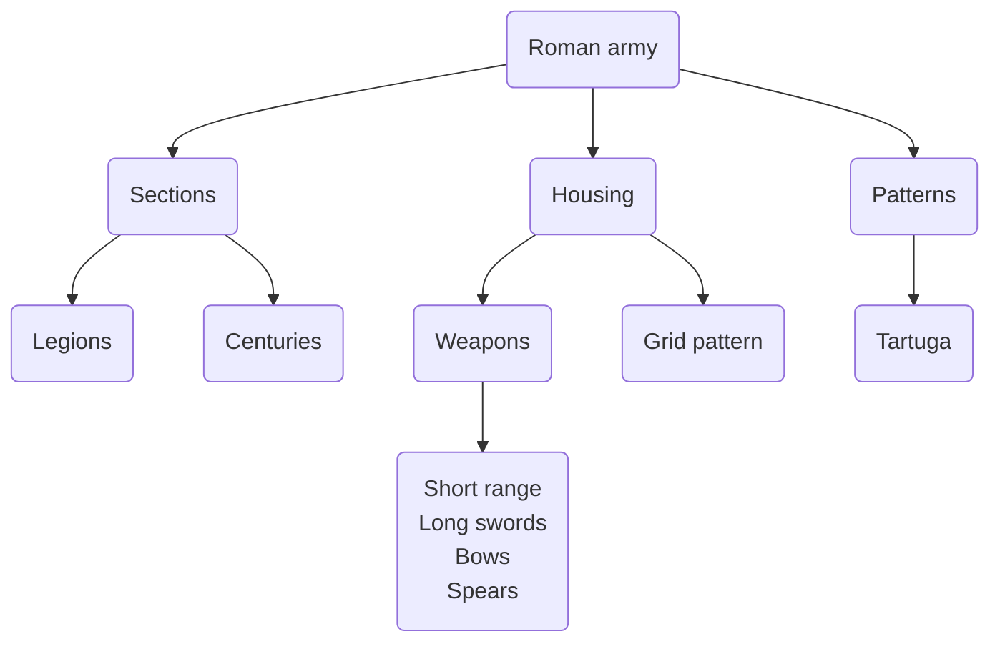
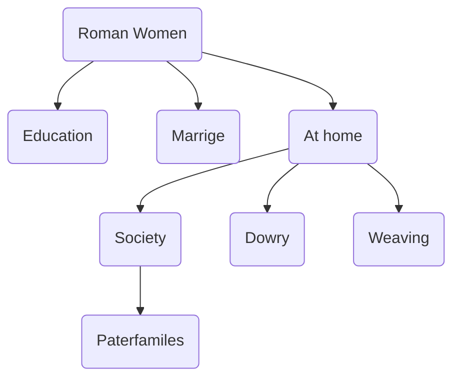
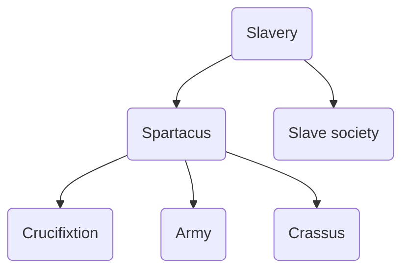

# Keywords

## Historian and Archeologist
[[Summary of Historian & Archeologist]]
[[Summary of keywords - Historian and Archeologist]]

### Historian
[[Historian]]

####  Primary source

#### Secondary source

#### Bias

#### Archives

#### Museum

#### Prejudice

#### Propaganda

### Archeologist
[[Archeologist]]

#### Archaeology

#### Artifact

#### Prehistory

#### Rescue Archaeology

#### Excavation

#### Survey

#### Accurate plan

#### Topsoil

#### Grid of squares
[[Deciding on a dig site]]

#### Trowels

#### Brushes

#### Sieves

#### Numbered

#### Airtight bags

#### Cataloged

#### Photographs

#### Laboratory

#### Dating
[[Dating artifacts]]

##### Straitigraphy

##### Tree Ring Dating

##### Carbon Dating

## Rome
[[Summary of keywords - Romans]]

### Pompeii
[[Pompeii]]

### Roman Army
[[Legions]]

#### Legion
[[Legions]]

#### Centuries
[[Legions]]

#### Centurion
[[Legions]]

#### Uniform
[[Weapons]]

#### Forts
[[Living conditions]]

#### Flogged
[[Living conditions]]

#### Equipment
[[Weapons]]

### Entertainment
[[Entertainment]]

#### Colleseum
[[Colleseum]]

#### Gladiators
[[Gladiator]]

#### Circus Maximus
[[Chariot racing]]

#### Chariot racing
[[Chariot racing]]

#### Baths
[[Baths]]

#### Plays
[[Plays]]

#### Amphitheatre
[[Plays]]

### Slavery
[[Slavery]]
[[Plebians]]
[[Slave work]]

#### Spartacus
[[Spartacus]]

#### Crassus
[[Spartacus]]

#### Crucifixion
[[Spartacus]]

### Patrician
[[Patricician]]

#### Domus
[[Roman Domus]]

#### Patrician Food
[[Partrician food]]

### Plebian
[[Plebians]]

#### Insuale
[[Insuale]]

#### Dole
[[Plebian Food]]

### Roman Women
[[Education]]
[[Marrige]]
[[Women in the house!]]

#### Paterfamilias
[[Roman society]]

#### Weaving

#### Dowry

## Early Christain Ireland
[[Christan Ireland]]

### Arrival of Christianity
[[St. Patrick]]

#### Christianity

#### Missionaries

#### St. Patrick
[[St. Patrick]]

#### Monasteries

#### Priests

#### Bishops

#### Monks

### Monasteries
[[What is a Monastary]]
[[Monastery buildings.]]

#### Prayer

#### Food

#### Sandals

#### Skellig Michael

#### Monk

##### Long Tunics

##### Woollen cloaks

### Where monks lived
[[Lifestyle of a monk]]

#### Beehive huts

#### Scriptorium

#### Refectory

#### Guesthouse

#### Abbot

#### Cemetery

#### Round tower
[[Round towers]]

### Lifestyle of a monk
[[Work of a monk]]

#### Manuscripts

#### Scribes

#### Vellum

#### Parchment

#### Quills

#### Inks

#### Chalices

#### High stone cross

### Irish monks abroad
[[Irish monks abroad]]

#### St. Columcille

#### St. Columbanus

#### Golden Age

## Middle ages

### Lords & Ladies
[[Lords]]
[[Ladies]]
[[Jousting]]
[[Jobs for ladies]]

### Knights
[[Medieval Knights]]

#### Feasts
[[Medieval feasts]]

### Black Death
[[Black Death]]

#### Plague

#### Anti semitism

### Fuedal system
[[What is the Feudal system]]

#### Kings
[[Kings]]

#### Nobles
[[Nobles]]

#### Knights

#### Peasants

### Castles

#### Motte & Bailey
[[Motte & Bailey]]

#### Moat

#### Stone Castles
[[Stone Castles]]

##### Drawbridge

##### Curtain Wall

##### Portcullis

##### Battlements

##### Keep

#### Siege
[[Sieges]]

#### Scaling ladders

#### Siege towers

#### Battering Rams

#### Undermining the wall

### Craftsmen and Merchants
[[Becoming a Craftsmen]]
[[Merchants and Craftsmen]]

#### Merchant

#### Craftsmen

##### Apprentice

##### Journeyman

#### Guilds
[[Guilds]]

### Normans
[[The Normans]]

#### William the Conqueror

#### Anglo-Normans

#### Strong bow

#### Bayeux Tapestry

#### Domesday Book

## The Renaissance
[[Background]]
[[Summary of keywords - Renaissance]]

### Beginning of the Renaissance

#### Art
[[Art in the Renissance]]

#### Perspective

#### Fresco

#### Sfumato

#### Portrait

#### Column

#### Rounded arches

#### Domes

#### Humanism
[[History/1st year/5. Renaissance/1. The beginning of the Renaissance/Humanism]]

#### Florence

### Patrons

### City states

### Constantinople

### Printing press
[[The Medici Family]]
[[The Printing Press]]

### Pisa

#### University of Pisa

### Maths and Philosophy

### University of Padua

### Telescope

### Moons of Jupiter

### "Two ChiefWorld Systems"

### Inquisition

### House arrest

### Neremburg

### Goldsmith

### Engravings

### Italy

### Court Painter

### Self Portraits

#### Portraits

### Wood and Copper

### The four horsemen of the apocalypse

### St. Jerome in his study

### The knight, death and the Devil

### Holland

### Plants and Animals

### Florence

### Noble

### Master Ghirlandio

### Donatello

### School of Sculpture

### Rome

### Pieta

### David

### Famous people
[[William Harvey]]
[[History/1st year/5. Renaissance/2. Famous people/William Shakespeare]]
[[Leonardo Da Vinci]]
[[Lorenzo De Medici]]
[[Ambroise Pare]]
[[Andreas Vesalius]]
[[Becoming an artist]]
[[Albrecht Durer]]
[[Michealanglo]]
[[Galileo]]

## Age of exploration
[[Causes]]
[[Summary of keywords - Age of Exploration]]

### Improvements in ships and navigation
[[Improvements in ships and navigation]]
[[Reasons for voyages]]

#### Caravel

#### Clinker built

#### Square sails

#### Lateen sails

#### Rudders

#### Castles

### Compass

### Latitude

### Astrolabes

### Quadrants

### Cross staffs

### Longitude
[[Longitude and Latitude]]

### Portolan Charts

### Log and Line

### Logbook

### Fear of seas

### New trade routes

### Wealth and fame

### Marco polo
[[Marco Polo]]

### Religion

### Christianity

### Rennissance

### Portugese Voyages

#### Wealth

#### Trade

#### Religion

#### Prince Henry the Navigator
[[Prince Henry the Navigator]]

#### Bartholomew Diaz
[[Bartholomew Diaz]]

#### Cape of good hope

#### Vasco de Gama
[[Vasco da gama]]

#### Christopher Columbus
[[Christopher Columbus]]

##### King Ferdinand and Queen Isabella

##### Pinta, Stana Maria and the Nina

##### Amerigo Yespucci

##### Treaty of Tordesillas
[[Treaty of Tordesillas]]

#### India

#### Conquistador
[[The conquistadors - Hernando cortes and the aztecs]]
[[The conquistadors - Francisco Pizarro and the Incas]]

#### Gold and silver

#### Hernando Cortes

#### Aztec

#### Montezuma

#### Incas

##### Pizarro

##### Atahualpa

#### The consequences of the age of exploration
[[Consequences of the age of exploration]]

##### Trade

##### New goods

##### Disease

##### Slavery

##### European conflict

## Reformation
[[Causes of the reformation]]
[[Summary of keywords - Reformation]]

### Abuses

#### Nepotism

#### Simony

#### Pluralism

#### Absenteeism

#### Indulgences

### Martin Luther
[[Martin Luther]]

#### University of Wittenberg

#### Justification by faith alone

#### John Teztel

#### 95 Theses

#### Lutheranism

#### Papal Bull

#### Excommunication

##### Diet of Worms

##### Edict of Worms

##### Wartburg Castle

### Counter reformation
[[Counter Reformation]]

#### Council of trent

##### Trentino

##### Matters of faith and discipline

##### Catholic Beliefs

##### Outlawed

##### Catechism

#### Society of Jesus

##### Ignatius Loyola

##### Strict Discipline

##### Missionaries

##### Francis Xavier

#### Iquisition

##### Heresy

##### Torture

##### Spying

##### Burning at the stake

## Ulster Plantation
[[Why plant Ireland]]

### Tudors

### Henry VIII

### Culture

### Religion

### Military Conquest

### Surrender and Regrant

### Ulser plantation

#### O'Neill's of Tyrone

#### King Phillip of Spain

#### O'Donnell's of Donegal

#### Battle of Kinsale

#### Queen Elizabeth

#### Treaty of Mellifont

#### Nine Years War
[[9 Years War]]

#### Flight of the Earls

### Changes in Ulster
[[Results of the Ulster Plantation]]

#### King James

#### 6 Counties

#### Crown Land

#### Church Land

#### Estates

#### Bawn

#### Rent

#### Loyal Irish

#### Servitors

#### Undertakers

# Links
#History #Keywords 
[[Homework - History]]

# Romans

