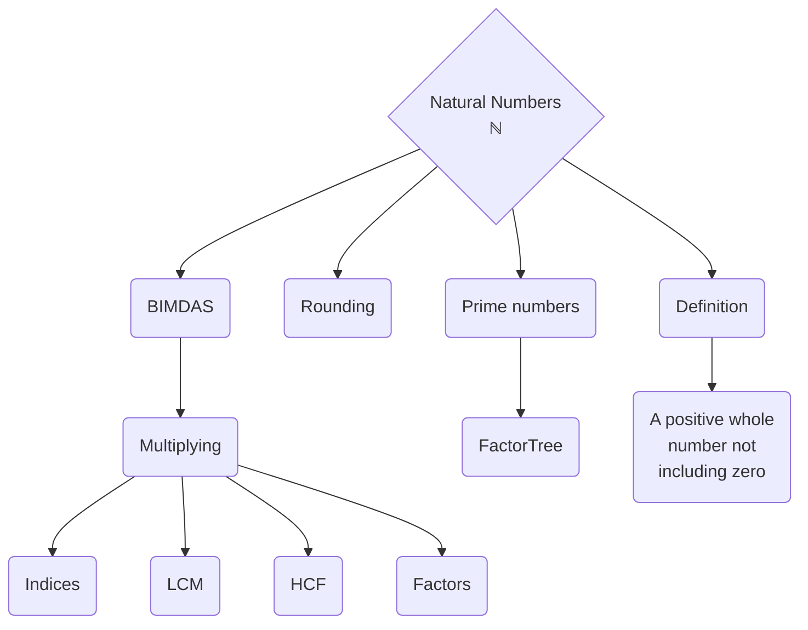
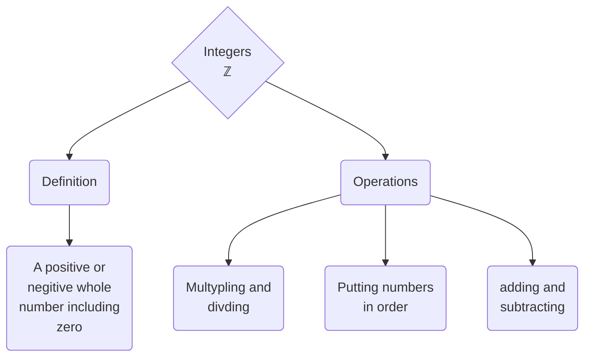
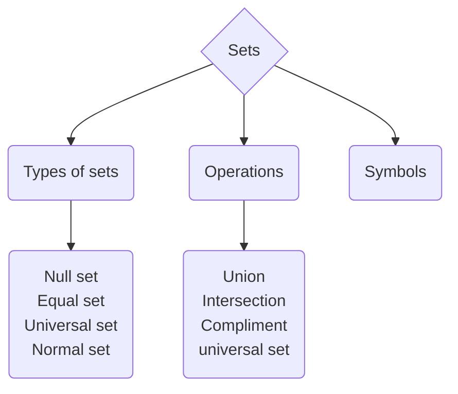
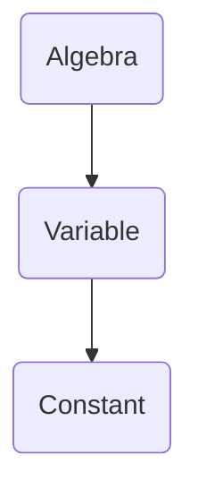

# Keywords
[[Number systems]]
[[Formulas]]

## Natural Numbers

### Word problems
[[Introduction to word based problems]]

### BIMDAS
[[BIMDAS]]

### Factors
[[Factors]]

### Multiple
[[Multiple]]

### Rounding
[[Rounding]]

### Squares and Indices
[[Squares and indices]]

### Commutative and Associative
[[Commutative and Associative]]

## Integers
[[Integers]]

### Multiplying integers
[[Multiplying integers]]

## Sets
[[A summary of sets]]

### Subsets

#### Null Set

#### Equal Set

### Universal Set

### Parts of a set

#### Intersction

#### Union

#### Compliment

## Algebra
[[Introduction to aglebrea]]

### Adding Algebra
[[Adding algebra]]

### Multiplying algebra
[[Multiplying algebrea]]

#### Multiplying with algebra
[[Multiplying with Algebrea]]

### Expanding/Removing brackets
[[Expanding brackets - Removing brackets]]

### Subtitution and Evaluation
[[Substitution or Evaluation]]

### Equations

#### Solving Equations
[[Solving Equations]]

##### Solving Linear Equations
[[Solving linear equations]]

## Coordinates
[[Introduction to coordinates]]

### Midpoint
[[Midpoint]]

### Slope of a line
[[Slope of a line]]

### Distance
[[Distance]]

## Probability
[[Introduction to probability]]

### Calculating probability
[[Calculating Probability]]

## Statistics
[[Introduction to statistics]]

### Data

#### Types of data

### Charts
[[Charts]]

# Homework
[[Homework - Maths]]
#Maths #Keywords 

